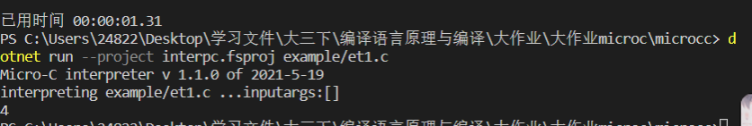

# [2020-2021学年第2学期](https://plc-sigcc.vercel.app/#/./lab/proj.final?id=_2020-2021学年第2学期)

# [**实 验 报 告**](https://plc-sigcc.vercel.app/#/./lab/proj.final?id=实-验-报-告)


- 课程名称:编程语言原理与编译

- 实验项目:期末大作业

- 专业班级__

- 学生学号___

- 学生姓名__

- 实验指导教师:张芸

  1. 评分方式，以下为起始评分

     - 按 及格 中 良 优 参考计分，最终看完成水平。

       ```
       60 70 80 90
       ```

       - [参考任务](https://gitee.com/sigcc/plzoofs/blob/master/microc/task.md)

     - 优秀

       - 参与实际的开源编译器项目
         - v rust julia 等
       - 自行完整实现一个较复杂的语言
         - 生成 中间语言、汇编
         - 实现高级的语言特性
           - 按特性实现难度给分

     - 良 完整实现一个简单语言

       - 词法/语法/语义检查，中间代码IR,栈式虚拟机

     - 中 实现一个简单语言

       - 实现 词法/语法/语义（类型检查，中间语言AST,IR）

     - 及格 修改实现一个简单语言

       - 修改 现有项目 简单的词法/语法，必须理解原来的代码
       - 实现需要包括解释器和编译器

  2. 提交内容

     - 项目报告
     - 项目源代码（测试代码）

**项目说明**

1.简介：

实现了编译器和解释器

项目 是基于现有的代码

- 改进 变量声明模块 多加了个char类型来表示字符串
- 改进了多目运算
- 改进了注释功能
- 改进了print模块

项目 独立开发：

- 独立开发了++，--模块
- 独立开发了switch模块
- 独立开发了return模块
- 独立开发了for模块
- 独立开发了do while 模块

2.代码结构分析

 ``` F#
Absyn.fs micro-C abstract syntax                              抽象语法
CLex.fsl micro-C lexer specification                          fslex词法定义
CPar.fsy micro-C parser specification                         fsyacc语法定义
Parse.fs micro-C parser                                       语法解析器
Interp.fs micro-C interpreter                                 解释器
example/s                例子程序
interpc.fsproj                                                项目文件

contcomp.fs compile micro-C to stack machine code  编译器

microc.fsproj                                                编译器项目文件
 ```


3.解决技术要点说明

解释器运行流程：

```
dotnet restore  interpc.fsproj   
dotnet clean  interpc.fsproj     
dotnet build -v n interpc.fsproj
dotnet run --project interpc.fsproj example/et1.c
```

编译器运行流程:

```

dotnet restore  microc.fsproj
dotnet clean  microc.fsproj  
dotnet build  microc.fsproj   

dotnet run --project microc.fsproj example/et1.c #生成.out
虚拟机运行：
# 编译 c 虚拟机
gcc -o machine.exe machine.c

# 虚拟机执行指令
./machine.exe ./example/et1.out
```

词法：


语法：


编译：


解释：


++：

void main() { //++

 int a;

 a=3;

 a++;

 print("%d",a);

}




--：

void main() { //--

 int a;

 a=3;

 a--;

 print("%d",a);

}


+=：

void main(){ //+=

  int a;

  a=1;

  a+=1;

  print(a);

}


for:

void main(){

  int a=1;

  int i=1;

  for(i=1;i<5;i++){

​    a++;

  }

  print("%d",a);

}


char

void main() {

 char a;

 a = 'a';

 print(a);

}


switch:

void main(int n){

  switch(n){

​    case (0) :

​      print(1);

​    case (1) :

​      print(2);

  }

}


三目运算：

void main(){

  int a = 1;

  int b = 2;

  int c = a>b?a:b;

  print(c);

}


注释

void main() {

 int n = 5;

 (*n=n-1;*)

 print("%d",n);

}


return:

int add(int n){

  n++;

  return n;

}

void main(){

  int a=1;

  a = add(a);

  print("%d",a);

}


print:

void main(){

  int a=8;

  print("%d",a);

}


do while:

void main(){

  int a=1;

  do{

​    a++;

  }

  while(a<5);

  print("%d",a);

}


#### 项目自评等级

| 内容            | 评分 | 备注 |
| --------------- | ---- | ---- |
| ++、-- 、+=、-= | ⭐⭐⭐  |      |
| for             | ⭐⭐⭐  |      |
| char            | ⭐⭐⭐  |      |
| switch case     | ⭐⭐   |      |
| 三目运算        | ⭐⭐   |      |
| 注释(*   *)     | ⭐⭐   |      |
| return          | ⭐⭐   |      |
| print           | ⭐⭐   |      |
| do while        | ⭐⭐⭐  |      |

| 姓名   | 学号     | 班级       | 任务                             | 权重   |
| ------ | -------- | ---------- | -------------------------------- | ------ |
| Name   | No.      | Class      | Task                             | Factor |
| 鲍永枭 | 31901101 | 计算机1904 | 部分解释器、编译器、语法词法修改 | 0.95   |
| 汪芷汀 | 31903095 | 计算机1904 | 部分解释器、编译器、语法此法修改 | 0.95   |

心得体会：

